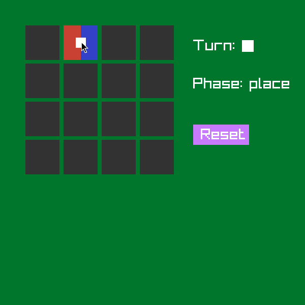

Aine LTAT.03.025 Henry ja Raido projekt

## Projekt

2 mängija mäng nagu trips-traps-trull  
Pildile vajutades näeb demo videot  

### Reeglid
- 4x4 mängulaud (kokku 16 ruutu)
- kummalgi mängijal on 8 ruudukujulist nuppu
- iga nupu mõlemal poolel on mängija sümbol
- iga nupu üks külg on sinist värvi ja teine külg oranži värvi
- mängijad käivad kordamööda
- käik
    - mängija keerab võimalusel ühe vastase nupu üle serva kõrvalruudule (keerata saab vaid tühjale ruudule, keeramise järel on nupp teistpidi ehk värv vahetub, aga nupu omanik jääb samaks)
    - mängija käib ühe oma nupu tühjale ruudule, enda valitud värv üleval pool
- võitmine
    - võidab see, kes saab esimesena kolm enda samavärvi nuppu järjest horisontaalselt, vertikaalselt või diagonaalselt
    - kui teine mängija saab enda käigu alguses nupu keeramisega kolmese jada ära lõhkuda, pole mäng läbi
    - kui vastane peab oma käigu alguses keerama mängija nupu nii, et mängija sai kolm järjest, on mängija võitnud

## UI
- Käimise faasis (place) kui hiir on ruudu kohal ja sellele ruudule saab käia, näidatakse ruudul punast ja sinist poolt ning mängija ikooni. Vajutades punasele või sinisele poolele saab sellele ruudule käia oma nupu vastavalt punane või sinine pool ülevalpool.  

- Keeramise faasis (turn) muutuvad keeratavad nupud heledamaks. Nuppu saab keerata üle serva vajutades nupu vastavale servale. Kui hiir on keeratava serva kohal, muudab keeramise suunas olev serv värvi (indikeerimaks, et see on valiidne käik) ning sinna vajutades keeratakse nupp üle vastava serva kõrvalruudule.  

- Kui mangija on mängu võitnud, tuuakse võitja ekraani allpool välja ning laual ei saa enam midagi teha. Kui kõik ruudud on täis ehk ei saa enam käia, aga kumbki mängija pole võitnud, on viik.  

- Mängu lõppedes (või ka mängu ajal) saab vajutada Reset nuppu mängulaua algseisu taastamiseks.

### Ehitamine
- `mkdir build`
- `cd build`
- `cmake ..`
- `make`
- `./main`

### dev keskkond

- peale cmake jooksutamist tekkis build kausta compile_commands.json, mida editorid oskavad kasutada, et language server toimiks ilusti.
- peaks toimima: `ln -s build/compile_commands.json compile_commands.json`.
